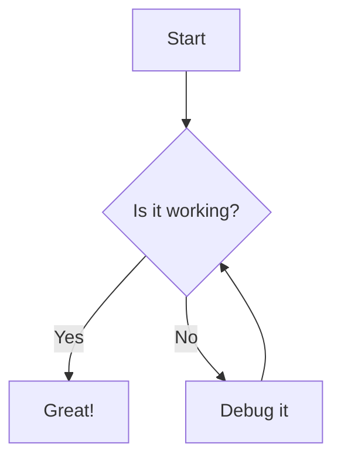
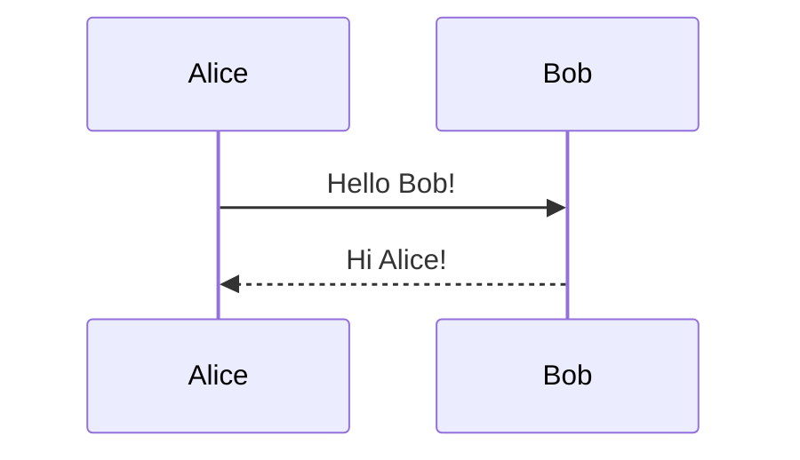
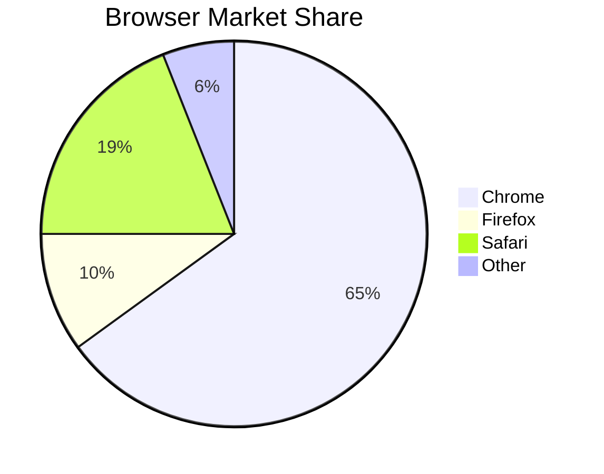

# 📝 The Complete Markdown Guide
> *Everything you need to know to write beautiful, powerful documents in Markdown*

---

## Table of Contents

- [What is Markdown?](#what-is-markdown)
- [Why Use Markdown?](#why-use-markdown)
- [Headings](#headings)
- [Text Formatting](#text-formatting)
- [Lists](#lists)
- [Links](#links)
- [Images](#images)
- [Code Blocks](#code-blocks)
- [Tables](#tables)
- [Blockquotes](#blockquotes)
- [Horizontal Rules](#horizontal-rules)
- [Task Lists / Checkboxes](#task-lists--checkboxes)
- [Badges & Button-Style Links](#badges--button-style-links)
- [Footnotes](#footnotes)
- [Collapsible Sections](#collapsible-sections)
- [Emoji](#emoji)
- [Keyboard Keys](#keyboard-keys)
- [Diff Highlighting](#diff-highlighting)
- [Math & Diagrams](#math--diagrams)
- [GitHub-Flavored Markdown (GFM)](#github-flavored-markdown-gfm)
- [Tips & Best Practices](#tips--best-practices)
- [Quick Reference Cheatsheet](#quick-reference-cheatsheet)

---

## What is Markdown?

**Markdown** is a lightweight markup language created by John Gruber in 2004. It lets you write plain text that automatically converts into beautifully formatted HTML — no HTML knowledge required.

It's the language behind:
- GitHub READMEs and wikis
- Notion, Obsidian, and Bear notes
- Reddit posts and comments
- Stack Overflow answers
- This very document you're reading!

---

## Why Use Markdown?

| Benefit | Description |
|---|---|
| 🚀 **Fast** | Write formatting in seconds without menus or toolbars |
| 📦 **Portable** | Plain `.md` files work everywhere — no special software needed |
| 🔁 **Version-controllable** | Git-friendly plain text — diff, merge, and track changes easily |
| 🌍 **Universal** | Supported by GitHub, GitLab, VS Code, Notion, Discord, Slack, and hundreds of tools |
| 👀 **Readable raw** | Even un-rendered Markdown is easy to read as plain text |
| ⚡ **Future-proof** | No proprietary format — your files will open in 20 years |

---

## Headings

Use `#` symbols to create headings. More `#` symbols = smaller heading.

```markdown
# H1 — Page Title (largest)
## H2 — Major Section
### H3 — Subsection
#### H4 — Sub-subsection
##### H5 — Smaller still
###### H6 — Smallest heading
```

**Renders as:**

# H1 — Page Title
## H2 — Major Section
### H3 — Subsection
#### H4 — Sub-subsection
##### H5 — Smaller still
###### H6 — Smallest heading

> 💡 **Tip:** Always put a space after the `#`. Leave a blank line before and after headings for best compatibility.

---

## Text Formatting

### Bold, Italic, Strikethrough, Highlight

```markdown
**bold text**
__also bold__

*italic text*
_also italic_

***bold and italic***

~~strikethrough~~

==highlighted text==        (some renderers only)

`inline code`
```

**Renders as:**

- **bold text**
- *italic text*
- ***bold and italic***
- ~~strikethrough~~
- `inline code`

### Combining Styles

```markdown
You can **combine _styles_ like** this, and even ***mix `code` with bold***.
```

You can **combine _styles_ like** this, and even ***mix `code` with bold***.

### Escaping Characters

To show a literal `*` or `#`, escape it with a backslash:

```markdown
\*This won't be italic\*
\# This won't be a heading
```

---

## Lists

### Unordered Lists

```markdown
- Apple
- Banana
- Cherry
  - Sub-item (indent with 2 spaces)
  - Another sub-item
    - Even deeper
```

- Apple
- Banana
- Cherry
  - Sub-item
  - Another sub-item
    - Even deeper

> You can also use `*` or `+` instead of `-` — they all work the same.

### Ordered Lists

```markdown
1. First step
2. Second step
3. Third step
   1. Sub-step A
   2. Sub-step B
```

1. First step
2. Second step
3. Third step
   1. Sub-step A
   2. Sub-step B

> 💡 **Cool trick:** You can use `1.` for every item — Markdown auto-numbers them correctly! Great for lists you'll reorder later.

```markdown
1. Item one
1. Item two
1. Item three
```

### Definition Lists *(extended Markdown)*

```markdown
Apple
:   A red fruit that grows on trees.

Markdown
:   A lightweight markup language for formatting text.
```

---

## Links

### Basic Links

```markdown
[Link text](https://example.com)
[Link with title](https://example.com "Hover tooltip text")
```

[Visit GitHub](https://github.com)
[Visit GitHub with tooltip](https://github.com "GitHub — where code lives")

### Auto Links

```markdown
<https://example.com>
<hello@example.com>
```

### Reference-Style Links

Great for long documents — define URLs once, use them many times:

```markdown
I love [GitHub][gh] and [Stack Overflow][so].

[gh]: https://github.com
[so]: https://stackoverflow.com
```

### Anchor Links (Jump to Section)

```markdown
[Jump to the Table of Contents](#table-of-contents)
```

> Headings automatically become anchors. Replace spaces with `-` and lowercase everything.

---

## Images

Images work just like links, but with a `!` prefix:

```markdown


```

### Image with Link

Wrap an image in a link to make it clickable:

```markdown
[](https://example.com)
```

### Controlling Image Size *(HTML inline)*

Pure Markdown doesn't support sizing, but HTML works inside Markdown:

```html

```

### Reference-Style Images

```markdown
![Logo][logo]

[logo]: https://example.com/logo.png "Company Logo"
```

---

## Code Blocks

### Inline Code

```markdown
Use the `print()` function to output text.
Run `npm install` to install dependencies.
```

Use the `print()` function to output text.

### Fenced Code Blocks

Wrap code in triple backticks. Add a language name for **syntax highlighting**:

````markdown
```python
def greet(name):
    print(f"Hello, {name}!")

greet("World")
```
````

```python
def greet(name):
    print(f"Hello, {name}!")

greet("World")
```

### Popular Language Tags

| Tag | Language |
|---|---|
| `python` | Python |
| `javascript` or `js` | JavaScript |
| `typescript` or `ts` | TypeScript |
| `bash` or `sh` | Shell / Bash |
| `json` | JSON |
| `yaml` | YAML |
| `html` | HTML |
| `css` | CSS |
| `sql` | SQL |
| `rust` | Rust |
| `go` | Go |
| `markdown` or `md` | Markdown itself |

### Indented Code Block (old-style)

4 spaces of indentation also creates a code block:

```markdown
    This is a code block
    created with 4 spaces
```

---

## Tables

```markdown
| Column 1     | Column 2     | Column 3     |
|--------------|--------------|--------------|
| Cell A1      | Cell B1      | Cell C1      |
| Cell A2      | Cell B2      | Cell C2      |
```

| Column 1 | Column 2 | Column 3 |
|----------|----------|----------|
| Cell A1 | Cell B1 | Cell C1 |
| Cell A2 | Cell B2 | Cell C2 |

### Column Alignment

```markdown
| Left-aligned | Center-aligned | Right-aligned |
|:-------------|:--------------:|--------------:|
| Left         | Center         | Right         |
| text         | text           | text          |
```

| Left-aligned | Center-aligned | Right-aligned |
|:-------------|:--------------:|--------------:|
| Left | Center | Right |
| text | text | text |

> 💡 **Tip:** You don't need to align the pipes — they just need to be present. VS Code's "Markdown All in One" extension can auto-format tables with `Alt+Shift+F`.

---

## Blockquotes

```markdown
> This is a blockquote.

> You can have **formatted text** inside quotes.
>
> And multiple paragraphs by adding a `>` on blank lines.

> Nested quote:
>> This is nested inside the first quote.
>>> And this is even deeper.
```

> This is a blockquote.

> You can have **formatted text** inside quotes.
>
> And multiple paragraphs by adding a `>` on blank lines.

> Nested quote:
>> This is nested inside the first quote.
>>> And this is even deeper.

### Callout-Style Blockquotes *(GitHub)*

GitHub supports special callout syntax:

```markdown
> [!NOTE]
> Highlights information that users should take into account.

> [!TIP]
> Optional information to help a user be more successful.

> [!IMPORTANT]
> Crucial information necessary for users to succeed.

> [!WARNING]
> Critical content demanding immediate user attention.

> [!CAUTION]
> Negative potential consequences of an action.
```

> [!NOTE]
> Highlights information that users should take into account.

> [!TIP]
> Optional information to help a user be more successful.

> [!WARNING]
> Critical content demanding immediate user attention.

---

## Horizontal Rules

Three or more dashes, asterisks, or underscores create a divider line:

```markdown
---
***
___
```

All three render as:

---

> 💡 Put blank lines before and after to avoid accidentally creating a heading.

---

## Task Lists / Checkboxes

One of the most useful GitHub Markdown features — interactive checkboxes!

```markdown
## Shopping List

- [x] Milk
- [x] Eggs
- [ ] Bread
- [ ] Coffee
- [ ] Cheese

## Project Tasks

- [x] Set up repository
- [x] Write README
- [ ] Add tests
- [ ] Deploy to production
```

**Renders as interactive checkboxes on GitHub:**

- [x] Milk
- [x] Eggs
- [ ] Bread
- [ ] Coffee

> 🎉 **Cool feature:** On GitHub Issues and Pull Requests, these checkboxes are **clickable** — team members can check off tasks in real time without editing the raw Markdown!

---

## Badges & Button-Style Links

Badges are image-links that look like colorful buttons. They're everywhere on GitHub READMEs!

### Using shields.io

```markdown


```


### Clickable Badge Buttons

Wrap badges in links to make them act like buttons:

```markdown
[](https://github.com/username/repo)
[](https://vscode.dev)
[](https://vercel.com/new)
```

### Common Badge Patterns

```markdown
<!-- Language badges -->


<!-- Status badges -->


<!-- Social badges -->


```

### Custom Color Options

| Color Name | Hex | Appearance |
|---|---|---|
| `brightgreen` | #4c1 | Success/passing |
| `green` | #97CA00 | Good |
| `yellowgreen` | #a4a61d | Acceptable |
| `yellow` | #dfb317 | Warning |
| `orange` | #fe7d37 | Concern |
| `red` | #e05d44 | Failure/error |
| `blue` | #007ec6 | Info/version |
| `lightgrey` | #9f9f9f | Inactive |

---

## Footnotes

Add footnotes for references without cluttering your text:

```markdown
Here is a sentence with a footnote.[^1]

This uses a named footnote.[^note]

[^1]: This is the footnote content. It appears at the bottom.
[^note]: Named footnotes are easier to manage in long documents.
```

Here is a sentence with a footnote.[^1]

[^1]: This is the footnote content at the bottom of the document.

---

## Collapsible Sections

Use HTML `<details>` tags inside Markdown for expandable sections:

```markdown
<details>
<summary>Click to expand this section</summary>

### Hidden Content

This content is hidden by default and reveals on click.

- You can put any Markdown here
- Lists, code blocks, images — everything works!

```python
print("Even code blocks work inside details!")
```

</details>
```

<details>
<summary>Click to expand this section</summary>

### Hidden Content

This content is hidden by default and reveals on click.

- You can put any Markdown here
- Lists, code blocks, images — everything works!

</details>

> 💡 **Great use case:** Long configuration examples, spoilers, optional reading sections, or long changelogs.

---

## Emoji

Use emoji shortcodes (supported on GitHub, Slack, Notion, and most modern renderers):

```markdown
:rocket: :star: :fire: :white_check_mark: :x: :warning: :bulb:
:heart: :thumbsup: :thumbsdown: :eyes: :100: :tada: :zap:
```

🚀 ⭐ 🔥 ✅ ❌ ⚠️ 💡 ❤️ 👍 👎 👀 💯 🎉 ⚡

You can also paste emoji directly: 🎨 🛠️ 📦 🔒 🌐

> Find all GitHub emoji shortcodes at [emoji.muan.co](https://emoji.muan.co)

---

## Keyboard Keys

The `<kbd>` HTML tag renders keyboard shortcuts beautifully:

```markdown
Press <kbd>Ctrl</kbd> + <kbd>C</kbd> to copy.
Press <kbd>Cmd</kbd> + <kbd>Shift</kbd> + <kbd>P</kbd> to open the command palette.
Save with <kbd>Ctrl</kbd> + <kbd>S</kbd>.
```

Press <kbd>Ctrl</kbd> + <kbd>C</kbd> to copy.
Press <kbd>Cmd</kbd> + <kbd>Shift</kbd> + <kbd>P</kbd> to open the command palette.

---

## Diff Highlighting

Use the `diff` language tag to show code changes with color:

````markdown
```diff
- const greeting = "Hello";
+ const greeting = "Hello, World!";
  console.log(greeting);
```
````

```diff
- const greeting = "Hello";
+ const greeting = "Hello, World!";
  console.log(greeting);
```

Lines starting with `-` turn **red**, lines with `+` turn **green**.

---

## Math & Diagrams

### Math (LaTeX) — GitHub & many note apps

```markdown
Inline math: $E = mc^2$

Block math:
$$
\frac{d}{dx}\left( \int_{a}^{x} f(u)\,du\right)=f(x)
$$
```

### Mermaid Diagrams — GitHub Native

GitHub renders [Mermaid](https://mermaid.js.org/) diagrams directly:

````markdown

````


**Other Mermaid diagram types:**

````markdown

````

````markdown

````

---

## GitHub-Flavored Markdown (GFM)

GitHub extends standard Markdown with powerful extras:

### Auto-linking

GitHub auto-links:
- Issue references: `#123` → links to issue 123
- PR references: `#456` → links to pull request 456
- @mentions: `@username` → links to a GitHub user
- Commit SHAs: `abc1234` → links to that commit
- URLs: `https://example.com` → auto-linked without brackets

### Repository Cross-references

```markdown
username/repo#123           — issue in another repo
username/repo@abc1234       — commit in another repo
```

### Code Permalink Highlighting

On GitHub, select lines in a file and press **Y** to get a permanent link that highlights those exact lines:

```
https://github.com/user/repo/blob/abc123/src/file.js#L42-L51
```

---

## Tips & Best Practices

### ✅ Do

- **Use blank lines** generously — they separate paragraphs and prevent rendering surprises
- **Indent consistently** — 2 or 4 spaces for nested lists (pick one and stick with it)
- **Keep line length reasonable** — ~80–120 chars for readability in raw view
- **Use reference links** for URLs that appear multiple times
- **Name your anchors** — descriptive headings create clean, shareable anchor links
- **Preview as you write** — VS Code has built-in Markdown preview (<kbd>Ctrl</kbd>+<kbd>Shift</kbd>+<kbd>V</kbd>)

### ❌ Avoid

- Mixing `*` and `-` for list bullets in the same document
- Putting heading `#` symbols without a space: `#Heading` (broken in some parsers)
- Relying on renderer-specific features without a fallback
- Giant unbroken walls of text — use headings and lists!

### 🛠️ Recommended Tools

| Tool | Use Case |
|---|---|
| **VS Code** | Best desktop Markdown editor with live preview |
| **Typora** | WYSIWYG Markdown editor |
| **Obsidian** | Personal knowledge base with linked notes |
| **HackMD / CodiMD** | Real-time collaborative Markdown |
| **Pandoc** | Convert Markdown to PDF, Word, HTML, etc. |
| **shields.io** | Generate badge SVGs |
| **Tables Generator** | Visual table builder → [tablesgenerator.com](https://www.tablesgenerator.com/markdown_tables) |
| **Mermaid Live** | Visual diagram editor → [mermaid.live](https://mermaid.live) |

---

## Quick Reference Cheatsheet

```
HEADINGS          TEXT              LISTS
# H1              **bold**          - unordered
## H2             *italic*          1. ordered
### H3            ~~strike~~        - [x] task done
#### H4           `code`            - [ ] task todo
                  ***bold italic***

LINKS & IMAGES    CODE              TABLES
[text](url)       `inline`          | A | B |
       ```               |---|---|
[ref][id]         block             | 1 | 2 |
[id]: url         ```

BLOCKQUOTE        HR                MISC
> quote           ---               <details>
>> nested         ***               <summary>
> [!NOTE]         ___               [^footnote]
> callout                           :emoji:
                                    <kbd>Key</kbd>
```

---

## File Extensions

Markdown files use these extensions:

| Extension | Use |
|---|---|
| `.md` | Standard — used everywhere |
| `.markdown` | Explicit/verbose form |
| `.mdx` | Markdown + JSX (React components) |
| `.mdwn` | Used by some wikis |

---

*Last updated: May 2026 · Written in Markdown, naturally* 🎉

[](https://daringfireball.net/projects/markdown/)
