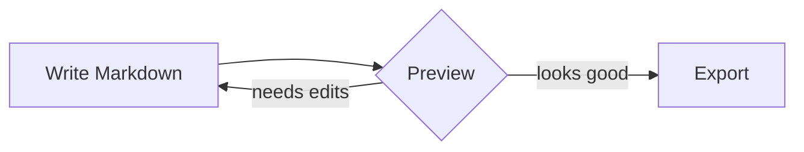

# ◆ Markdown Editor

> A powerful, single-file Markdown editor — no install, no server, no dependencies to manage.  
> Open `markdown-editor.html` in any modern browser and start writing.

---

## Table of Contents

- [Overview](#overview)
- [Getting Started](#getting-started)
- [The Interface](#the-interface)
- [Header Buttons](#header-buttons)
- [The More Menu](#the-more-menu)
- [Formatting Toolbar](#formatting-toolbar)
- [Multi-Tab System](#multi-tab-system)
- [Live Preview](#live-preview)
- [Find & Replace](#find--replace)
- [Preview Search](#preview-search)
- [Preview Modal](#preview-modal)
- [Document Library](#document-library)
- [Status Bar & Word Count Goal](#status-bar--word-count-goal)
- [Zen Mode](#zen-mode)
- [Drag & Drop Import](#drag--drop-import)
- [Image Paste from Clipboard](#image-paste-from-clipboard)
- [URL Sharing](#url-sharing)
- [Table of Contents Generator](#table-of-contents-generator)
- [Backup & Restore](#backup--restore)
- [Mermaid Diagrams](#mermaid-diagrams)
- [Math Rendering (KaTeX)](#math-rendering-katex)
- [Code Blocks with Copy Button](#code-blocks-with-copy-button)
- [Scroll Sync](#scroll-sync)
- [Mobile Layout](#mobile-layout)
- [Keyboard Shortcuts](#keyboard-shortcuts)
- [Auto-Save](#auto-save)
- [Security](#security)
- [Browser Requirements](#browser-requirements)

---

## Overview

**Markdown Editor** is a zero-dependency, self-contained HTML file that packs a professional writing environment into a single download. Every feature — from Mermaid diagram rendering to regex-powered Find & Replace — works offline in your browser.

**What makes it special:**

- 🗂️ **Multi-tab** document management (up to 20 tabs)
- ⚡ **Live split-pane preview** with scroll synchronization
- 📊 **Mermaid diagrams** rendered inline as SVG
- ∑ **KaTeX math** for `$LaTeX$` formulas
- 🔒 **DOMPurify XSS protection** — safe to preview untrusted content
- 💾 **Auto-saves** to `localStorage` — survives browser refreshes
- 📚 **Document Library** — named snapshots for version-like saves
- 🎯 **Word count goal** with live progress bar
- ♿ **Full accessibility** — ARIA labels, keyboard navigation, focus traps

---

## Getting Started

1. Double-click `markdown-editor.html` to open it in your browser
2. Start typing Markdown in the left pane — the right pane updates live
3. Your work saves automatically to your browser's local storage

> **Offline use:** The editor loads CodeMirror and other libraries from CDN on first use. Once cached, it works offline. For a fully offline-ready build, self-host the CDN scripts (see comments in the HTML source).

---

## The Interface

```
┌─────────────────────────────────────────────────────────────────┐
│  ◆ Markdown  │  ⊞ Zen  │ 👁 Preview │ ☀ Theme │ Export .md │ ⋯ │  ← Header
├──────────────────────────────────────────────────────────────────┤
│  [Tab 1]  [Tab 2]  [Tab 3 ×]  [+]                               │  ← Tab Bar
├──────────────────────────────────────────────────────────────────┤
│  B  I  S  </>  │  H1  H2  H3  │  • List  1.List  ☐ Task  " Quote│  ← Toolbar
│  Code  Diagram  ∑ Math  🔗 Link  📷 Img  ⊞ Table  — HR  │  🔍 F&R│
├──────────────────────────────────────────────────────────────────┤
│                     │  │                                         │
│  Markdown Editor    │  │  Live Preview                           │
│  (CodeMirror 6)     │◄─┤  (rendered HTML)                       │
│                     │  │                                         │
│                     │  │  ← Drag divider to resize →            │
├──────────────────────────────────────────────────────────────────┤
│  Words: 0  Chars: 0  Lines: 0  Read time: 0 min  Goal: [___] ██ │  ← Status Bar
└──────────────────────────────────────────────────────────────────┘
```

---

## Header Buttons

| Button | Shortcut | What it does |
|--------|----------|-------------|
| **⊞ Zen** | `F11` | Hides toolbar, tabs, and preview — pure writing focus |
| **👁 Preview** | `Ctrl+P` | Opens the document in a full-screen preview modal |
| **☀ Theme** | — | Toggles preview between **light** and **dark** themes |
| **Export .md** | — | Downloads the current tab as a `.md` file |
| **⋯ More** | — | Opens a dropdown with additional options |

---

## The More Menu

Click **⋯ More** in the header to access:

| Menu Item | What it does |
|-----------|-------------|
| **🖨 Print** | Opens a clean print dialog (formatted, no editor chrome) |
| **Export HTML** | Downloads the rendered preview as a standalone `.html` file with embedded CSS |
| **📚 Docs** | Opens the Document Library for named snapshots |
| **🔗 Share** | Encodes the document into a URL and copies it to clipboard |
| **⊞ TOC at cursor** | Inserts a linked Table of Contents at the cursor position |
| **⊞ TOC at top** | Inserts a Table of Contents at the very top of the document |
| **✓ Spell** | Toggles browser spell check in the editor |
| **💾 Backup** | Downloads all tabs as a JSON backup file |
| **↩ Restore** | Restores tabs from a JSON backup file |
| **? Keys** | Opens the keyboard shortcuts reference |
| **Clear** *(red)* | Clears the current tab — requires two clicks to confirm |

> 💡 **Two-click Clear:** The first click shows a warning toast; the second click actually clears. This prevents accidental data loss.

---

## Formatting Toolbar

The toolbar wraps selected text or inserts at the cursor:

### Text Formatting
| Button | Output | Shortcut |
|--------|--------|----------|
| **B** | `**bold**` | `Ctrl+B` |
| *I* | `*italic*` | `Ctrl+I` |
| ~~S~~ | `~~strikethrough~~` | — |
| `</>` | `` `inline code` `` | — |

### Headings
| Button | Output |
|--------|--------|
| **H1** | `# Heading` (toggles; click again to remove) |
| **H2** | `## Heading` |
| **H3** | `### Heading` |

> Smart toggle: clicking H2 on an existing H3 line *replaces* the prefix, not stacks it.

### Lists & Structure
| Button | Output |
|--------|--------|
| **• List** | `- item` (toggle prefix on each selected line) |
| **1. List** | `1. item` |
| **☐ Task** | `- [ ] item` |
| **" Quote** | `> blockquote` |

### Insertions
| Button | What inserts |
|--------|-------------|
| **Code** | Fenced code block ` ```\ncode\n``` ` |
| **Diagram** | Starter Mermaid `graph LR` block |
| **∑ Math** | `$$\n\n$$` display math block (or wraps selection in `$...$`) |
| **🔗 Link** | `[link text](https://)` — URL placeholder auto-selected |
| **📷 Img** | `` — URL placeholder auto-selected |
| **⊞ Table** | 3×2 starter table with headers |
| **— HR** | `\n\n---\n\n` horizontal rule |
| **🔍 F&R** | Opens Find & Replace panel (`Ctrl+H`) |

### Sync indicator
The **`sync`** pill on the right side of the toolbar flashes blue whenever scroll-sync fires between the editor and preview.

---

## Multi-Tab System

Create and manage multiple documents simultaneously.

### Tab bar controls

| Action | How |
|--------|-----|
| **New tab** | Click **+** or press `Ctrl+T` |
| **Switch tabs** | Click a tab, or use `←` / `→` arrow keys when a tab has focus |
| **Close tab** | Click the **×** on the tab, press `Ctrl+W`, or press `Delete`/`Backspace` on a focused tab |
| **Rename tab** | **Double-click** the tab title, type a new name, press `Enter` |
| **Reopen closed tab** | `Ctrl+Shift+T` (last 5 closed tabs remembered) |

**Limits:**
- Maximum **20 tabs** open at once
- Tab titles max **100 characters**
- Closing the last tab clears it instead of removing it

---

## Live Preview

The right pane renders your Markdown in real time using **Marked.js** (GFM mode) with:

- ✅ Tables, strikethrough, task lists
- ✅ Hard line breaks
- ✅ Mermaid diagrams
- ✅ KaTeX math
- ✅ Syntax-highlighted code blocks
- ✅ DOMPurify XSS sanitization before rendering

The preview pane can be resized by **dragging the divider** between the two panes. Use `←` / `→` arrow keys on the divider for keyboard control (`Shift` for 5% steps). The split position is saved across sessions.

---

## Find & Replace

Open with `Ctrl+H` or the **🔍 F&R** toolbar button.

```
┌─────────────────────────────────────────────┐
│  🔍 Find & Replace                      [✕] │
│  [  Search query...          ]   3 / 12      │
│  [  Replacement text ($1$2…) ]               │
│  [✓] Regex  [✓] Case   [↑] [↓] Replace  All │
└─────────────────────────────────────────────┘
```

| Control | Function |
|---------|----------|
| **Find field** | Type to build match list — updates as you type |
| **Match counter** | Shows `n / total` or `No matches` |
| **↑ / ↓ buttons** | Navigate to previous / next match (wraps with toast notification) |
| **Replace** | First click: jumps to first match. Second click: replaces and advances |
| **All** | Replaces all matches at once — shows count in toast |
| **Regex checkbox** | Enables full JavaScript regex (`$1`, `$2` capture groups in replacement) |
| **Case checkbox** | Makes search case-sensitive |

> **Security:** Queries are capped at 200 characters and match count is capped at 5,000 to prevent ReDoS attacks via catastrophic backtracking.

---

## Preview Search

Search **within the rendered preview** (not the raw Markdown source).

- Open with `Ctrl+F` when focus is **outside** the editor (or `Ctrl+F` inside editor opens F&R instead)
- Matches are highlighted in **yellow**; the current match is **orange**
- Navigate with `Enter` (next) / `Shift+Enter` (previous)
- Close with `Esc`

```
│  [ Search preview…  ]  3 / 8  [↑] [↓] [✕]  │
```

---

## Preview Modal

Press `Ctrl+P` or click **👁 Preview** to open a full-screen view of the rendered document.

The modal has its own action buttons:
- **🖨 Print** — clean print stylesheet, no editor chrome
- **Export HTML** — standalone HTML file with embedded styles
- **Export .md** — raw Markdown file
- **✕ Close** — `Esc`

---

## Document Library

Open via **⋯ More → 📚 Docs**. Save named snapshots of any document — useful for versioning, checkpoints, or comparing drafts.

### Saving a snapshot
1. Type a name in the **Snapshot name** field (defaults to the current tab title)
2. Click **💾 Save snapshot**

Each snapshot records:
- Document name
- Full content
- Word count & character count
- Date/time saved

### Using snapshots
| Action | Button |
|--------|--------|
| **Load** | Replaces current tab content (confirms if tab has content) |
| **Delete** | **✕** — asks for confirmation |

**Limits:** Maximum 50 snapshots. Adding a 51st removes the oldest automatically.

---

## Status Bar & Word Count Goal

The blue bar at the bottom shows live document statistics:

```
Words: 248   Chars: 1,423   Lines: 38   Read time: 2 min   Goal: [500] ████░░░░  49%
```

| Stat | How it's calculated |
|------|---------------------|
| **Words** | Smart count — strips code blocks, headings `#`, markdown syntax, and table separators |
| **Chars** | Raw character count including whitespace |
| **Lines** | Line count from CodeMirror |
| **Read time** | `⌈words ÷ 200⌉` minutes (200 wpm average) |

### Word Count Goal
Set a target word count in the **Goal** field at the right of the status bar:
- Progress bar fills as you write
- Turns **dark green** when the goal is reached
- Turns **purple** when you've exceeded the goal
- Shows `+n` words over goal when exceeded
- Goal is persisted across sessions

---

## Zen Mode

Press **F11** or click **⊞ Zen** to enter distraction-free writing:

- ✅ Toolbar hidden
- ✅ Tab bar hidden
- ✅ Preview pane hidden
- ✅ Header becomes semi-transparent
- ✅ Pane labels fade out

Press **F11** again or click **✕ Exit Zen** to return to the normal layout.

---

## Drag & Drop Import

Drag any `.md`, `.markdown`, or `.txt` file onto the **editor pane** to import it:

- The file content replaces the current tab
- The tab title is set to the filename (without extension)
- Maximum file size: **2 MB**

A dashed outline appears on the editor when a valid file is dragged over it.

---

## Image Paste from Clipboard

Paste an image directly from the clipboard (`Ctrl+V`) while the editor is focused:

- The image is converted to a **base64 data URL** and inserted as ``
- Maximum image size: **2 MB** (larger images must be hosted externally)
- A toast warns about storage inflation for large images

### Smart URL paste
If you have text **selected** and paste a URL (`https://...`), it auto-formats as:
```markdown
[selected text](https://your-url)
```

---

## URL Sharing

Via **⋯ More → 🔗 Share**:

1. The current document is **base64-encoded** into the URL hash
2. The full shareable URL is **copied to clipboard**
3. Paste the URL and anyone with the link can open it in their browser
4. On load, a prompt asks "Load shared document into a new tab?"

> **Note:** Very long documents produce very long URLs (some apps truncate at ~8,000 characters). A toast warns you if the URL exceeds this.

---

## Table of Contents Generator

Via **⋯ More → TOC at cursor** or **TOC at top**:

- Scans all headings (`#` through `######`) in the document
- Skips headings inside fenced code blocks
- Generates a nested list of anchor links matching GitHub's GFM slug algorithm
- Handles **duplicate heading names** by appending `-1`, `-2`, etc.

**Example output:**
```markdown
**Table of Contents**

- [Introduction](#introduction)
- [Getting Started](#getting-started)
  - [Installation](#installation)
  - [Configuration](#configuration)
- [API Reference](#api-reference)
```

---

## Backup & Restore

### Backup
**⋯ More → 💾 Backup** — downloads a `markdown-backup.json` file containing:
- All open tabs (titles + full content)
- Which tab was active
- Export timestamp

### Restore
**⋯ More → ↩ Restore** — opens a file picker for a `.json` backup file:
- Validates the file structure before restoring
- Confirms before replacing current tabs
- Enforces the 20-tab maximum

---

## Mermaid Diagrams

Write a fenced code block with `mermaid` as the language:

````markdown

````

The diagram renders as an **SVG** directly in the preview. Supported diagram types include:

| Type | Syntax |
|------|--------|
| Flowchart | `graph TD` / `graph LR` |
| Sequence diagram | `sequenceDiagram` |
| Gantt chart | `gantt` |
| Pie chart | `pie` |
| Class diagram | `classDiagram` |
| State diagram | `stateDiagram-v2` |
| Entity relationship | `erDiagram` |

If the diagram has a syntax error, a red error block shows the message instead.

**Performance:** Identical diagram source is cached — re-rendering won't hit Mermaid unless the code changes.

---

## Math Rendering (KaTeX)

Write math using LaTeX syntax:

**Inline math** — wrap in single `$...$`:
```
The energy formula is $E = mc^2$.
```

**Display math** — wrap in `$$...$$` on its own lines:
```
$$
\frac{d}{dx}\left( \int_a^x f(u)\,du \right) = f(x)
$$
```

**Standard LaTeX delimiters** also work:
- `\(...\)` for inline
- `\[...\]` for display

Click **∑ Math** in the toolbar to insert a display math block (or wrap selected text in inline `$...$`).

---

## Code Blocks with Copy Button

Code blocks in the preview get an automatic **Copy** button that appears on hover:

````markdown
```javascript
function greet(name) {
  return `Hello, ${name}!`;
}
```
````

- Hover over any code block → **Copy** button appears (top-right corner)
- Click to copy → button changes to **Copied!** for 1.6 seconds
- Works in both the split preview and the Preview Modal

---

## Scroll Sync

The editor and preview scroll together automatically:

- Scroll in the **editor** → preview follows proportionally
- Scroll in the **preview** → editor follows proportionally
- The **`sync`** indicator in the toolbar flashes blue when sync fires

Scroll sync uses a lock mechanism to prevent feedback loops.

---

## Mobile Layout

On screens **≤ 768px**, the layout switches to a stacked single-pane view:

- A **✏ Editor / 👁 Preview** tab strip appears below the header
- The divider is hidden
- Both panes are full-width — switch between them with the tab strip
- The toolbar expands to two rows if needed

---

## Keyboard Shortcuts

Press **`?`** (outside the editor) to open the full shortcuts reference modal.

### Navigation
| Shortcut | Action |
|----------|--------|
| `Ctrl+P` | Open preview modal |
| `Ctrl+H` | Open Find & Replace |
| `Ctrl+T` | New tab |
| `Ctrl+W` | Close active tab |
| `Ctrl+Shift+T` | Reopen last closed tab |
| `F11` | Toggle Zen mode |
| `Esc` | Close any open modal/panel |
| `Ctrl+F` | F&R (editor focused) / Preview search (elsewhere) |
| `?` | Open keyboard shortcuts reference |

### Editor Formatting
| Shortcut | Action |
|----------|--------|
| `Ctrl+B` | Bold |
| `Ctrl+I` | Italic |
| `Ctrl+K` | Insert link |
| `Ctrl+Z` | Undo |
| `Ctrl+Shift+Z` | Redo |

### Tab Bar (when tab button has focus)
| Key | Action |
|-----|--------|
| `←` / `→` | Switch to previous/next tab |
| `Home` / `End` | Jump to first/last tab |
| `Delete` / `Backspace` | Close active tab |

### Find & Replace Panel
| Key | Action |
|-----|--------|
| `Enter` (in Find field) | Find next |
| `Enter` (in Replace field) | Replace current match |

### Preview Search
| Key | Action |
|-----|--------|
| `Enter` | Next match |
| `Shift+Enter` | Previous match |
| `Esc` | Close |

### Other
| Action | How |
|--------|-----|
| Import `.md` file | Drag & drop onto editor |
| Paste image | `Ctrl+V` with image in clipboard |
| Paste URL as link | Select text, then `Ctrl+V` a URL |
| Double-click tab title | Rename tab |

---

## Auto-Save

Every change is **automatically saved** to `localStorage` with a 400ms debounce:

- A **✓ Saved** badge fades in/out after each save
- Saves include: all tab titles, all tab content, the active tab ID
- The word count goal and pane split position are also persisted
- If storage is full, a toast error prompts you to export your work

Content persists across browser refreshes, closed tabs, and computer restarts — as long as you use the same browser profile and don't clear site data.

---

## Security

The editor is built with several security layers:

| Protection | Detail |
|------------|--------|
| **DOMPurify** | All rendered HTML is sanitized before insertion — blocks XSS via crafted Markdown |
| **Blocked HTML tags** | `<script>`, `<style>`, `<iframe>`, `<object>`, `<embed>`, `<form>`, `<base>` and more are stripped |
| **Blocked attributes** | All `on*` event handlers (`onclick`, `onerror`, `onload`, etc.) are removed |
| **SVG sanitization** | Mermaid SVG output is sanitized — `foreignObject` and `xlink:href` are blocked |
| **SRI hashes** | All CDN resources use Subresource Integrity hashes — tampering is detected by the browser |
| **ReDoS guards** | Find & Replace and Preview Search cap query length at 200 chars and match count at 5,000 |
| **No inline event handlers** | All JS is in a single ES module — no `onclick=""` attributes anywhere |
| **Safe localStorage** | Quota errors are caught and surfaced as toasts instead of silent data loss |

---

## Browser Requirements

| Browser | Minimum Version |
|---------|----------------|
| Chrome / Edge | 61+ |
| Firefox | 60+ |
| Safari | 10.1+ |

Requires **JavaScript enabled** and **ES module support**.

If JavaScript is disabled, a `<noscript>` message is shown.  
If the browser doesn't support ES modules (very old browsers), a legacy fallback message replaces the editor.  
If the CDN is unreachable, a retry screen is shown with a **Retry** button.

---

## File Details

| Property | Value |
|----------|-------|
| **File** | `markdown-editor.html` |
| **Size** | Single `.html` file, ~2,800 lines |
| **External deps** | CodeMirror 6, Marked.js, Mermaid.js, KaTeX, DOMPurify (all CDN-loaded, SRI-pinned) |
| **Local storage keys** | `md-tabs-v1`, `md-active-v1`, `md-preview-theme`, `md-wc-goal`, `md-doc-library`, `md-pane-split`, `md-spell-check` |
| **No server required** | ✅ Works as a local file (`file://`) |
| **No account required** | ✅ Everything stays in your browser |

---

*Open `markdown-editor.html` — start writing.* ✍️
